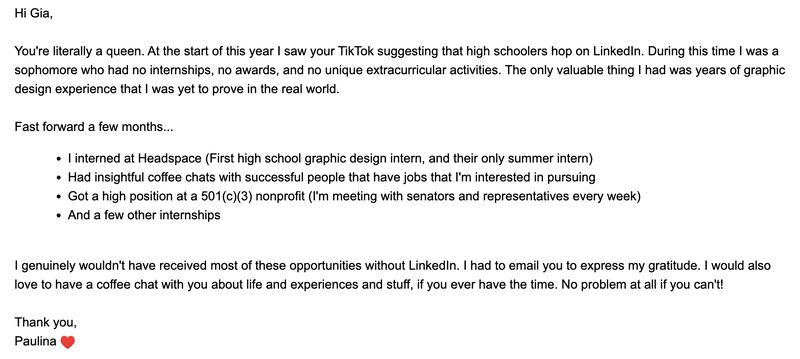

{/* truncate */}

## The Great Example
Here's a great example of cold emailing, keep it short, add bullet points to make it easier to read, and make it visually appealing:

Can try through email, twitter, or linkedin! Though try not to make this stalky, see which platform they're more active on and or more likely to reply. 

P.S. When you send a message on any of these platforms don't just say "Hi" or "Hello" and think they'll respond before sending your actual pitch. It
wastes time of both parties and is un-needed if the other person is busy. Send your HIs and Hellos ALONG with the actual message you're trying to send.

## Bonus on how to find their email

<a href="https://www.cscareers.dev/blog/landing-software-engineer-interviews-through-cold-emailing">Link to post</a>
<iframe width={"100%"} height={1000} src="https://www.cscareers.dev/blog/landing-software-engineer-interviews-through-cold-emailing"></iframe>

<h3>Read more related content <a href="https://www.cscareers.dev/">here</a></h3>